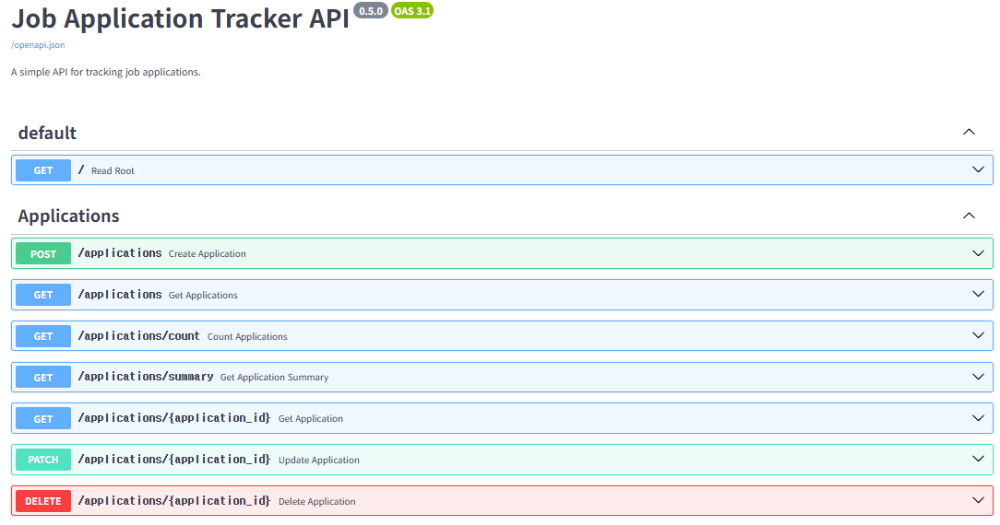
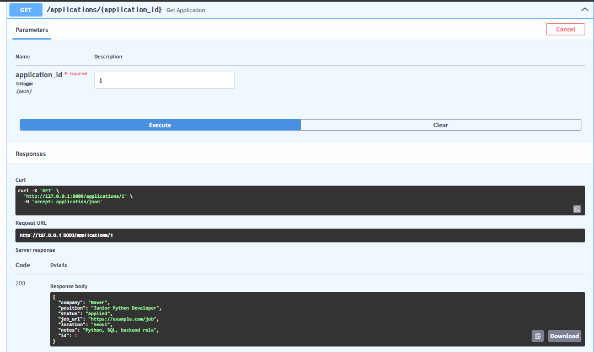
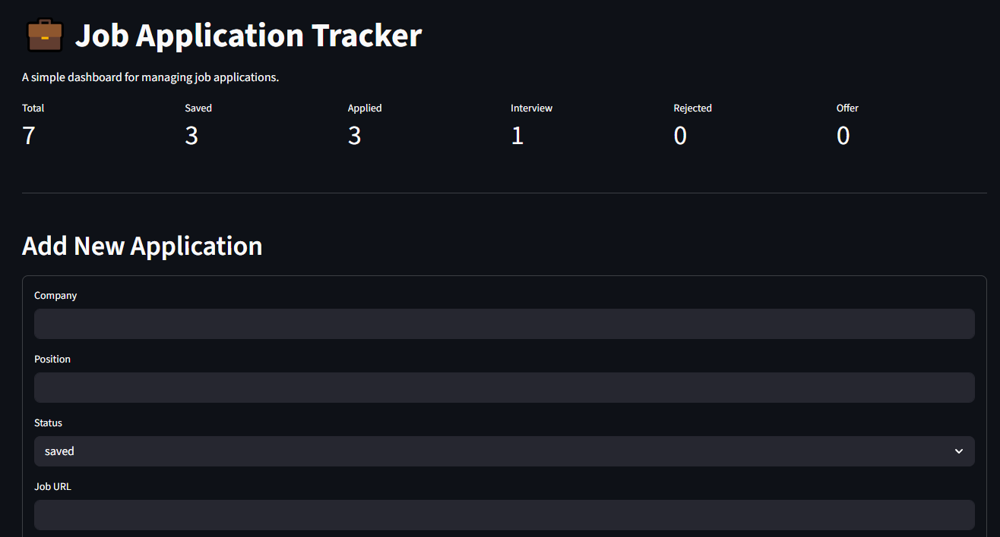

# Job Application Tracker API

A FastAPI backend project for tracking job applications, managing application statuses, searching/filtering saved job records, and separating each user's data with JWT authentication.

This project was built as a practical Python backend portfolio project. It demonstrates REST API development, PostgreSQL database integration, JWT authentication, user-specific CRUD operations, modular project structure, Docker Compose, a simple Streamlit dashboard, and automated API testing.

---

## Features

- User registration and login with JWT authentication
- Create, read, update, and delete job applications
- Store job applications in a PostgreSQL database
- Keep each user's job applications separated by account
- Filter applications by status, company, and location
- Search applications by keyword
- Sort applications by ID, company, position, status, or location
- Use pagination with `skip` and `limit`
- View total application count
- View application status summary
- Interactive API documentation with FastAPI Swagger UI
- Automated API tests with pytest
- Modular backend structure using routers, schemas, CRUD logic, authentication logic, and database models
- Simple Streamlit frontend dashboard with login/register support
- Run FastAPI, PostgreSQL, and Streamlit together with Docker Compose

---

## Tech Stack

- Python
- FastAPI
- PostgreSQL
- SQLite for testing
- SQLAlchemy
- Pydantic
- JWT / PyJWT
- pwdlib
- pytest
- Git / GitHub
- Docker
- Docker Compose
- Streamlit
- pandas
- requests

---

## Project Structure

```text
job-application-tracker-api/
├── app/
│   ├── routers/
│   │   ├── applications.py
│   │   └── auth.py
│   ├── auth.py
│   ├── crud.py
│   ├── database.py
│   ├── main.py
│   ├── models.py
│   └── schemas.py
├── frontend/
│   └── streamlit_app.py
├── tests/
│   └── test_applications.py
├── screenshots/
├── Dockerfile
├── docker-compose.yml
├── README.md
├── requirements.txt
└── .gitignore
```

---

## API Overview

### Authentication

| Method | Endpoint | Description |
|---|---|---|
| `POST` | `/auth/register` | Register a new user |
| `POST` | `/auth/login` | Log in and receive a JWT access token |
| `GET` | `/auth/me` | Get the currently authenticated user |

### Applications

All `/applications` endpoints require JWT authentication.

| Method | Endpoint | Description |
|---|---|---|
| `GET` | `/` | Root endpoint |
| `POST` | `/applications` | Create a new job application |
| `GET` | `/applications` | Get all job applications for the current user |
| `GET` | `/applications/{application_id}` | Get one application by ID |
| `PATCH` | `/applications/{application_id}` | Update an application |
| `DELETE` | `/applications/{application_id}` | Delete an application |
| `GET` | `/applications/count` | Get total number of applications |
| `GET` | `/applications/summary` | Get application status summary |

---

## Example User Registration

```json
{
  "email": "test@example.com",
  "full_name": "Test User",
  "password": "password123"
}
```

---

## Example Login

The login endpoint uses form data.

```text
username: test@example.com
password: password123
```

The response returns an access token:

```json
{
  "access_token": "jwt-token-value",
  "token_type": "bearer"
}
```

Use the token in Swagger UI by clicking **Authorize**.

---

## Example Application Data

```json
{
  "company": "Naver",
  "position": "Junior Python Developer",
  "status": "applied",
  "job_url": "https://example.com/job",
  "location": "Seoul",
  "notes": "Python, SQL, backend role"
}
```

---

## Query Examples

Get all applications:

```http
GET /applications
```

Filter by status:

```http
GET /applications?status=applied
```

Filter by company:

```http
GET /applications?company=naver
```

Search by keyword:

```http
GET /applications?search=python
```

Sort by company:

```http
GET /applications?sort_by=company&sort_order=asc
```

Use pagination:

```http
GET /applications?skip=0&limit=10
```

Get total count:

```http
GET /applications/count
```

Get status summary:

```http
GET /applications/summary
```

---

## Status Types

The application status can be one of the following:

```text
saved
applied
interview
rejected
offer
```

---

## How to Run with Docker Compose

Build and start the FastAPI backend, PostgreSQL database, and Streamlit frontend:

```bash
docker compose up --build
```

Open the FastAPI documentation:

```text
http://127.0.0.1:8000/docs
```

Open the Streamlit frontend:

```text
http://127.0.0.1:8501
```

Stop the containers:

```bash
docker compose down
```

Reset the PostgreSQL volume during development:

```bash
docker compose down -v
docker compose up --build
```

---

## How to Run Locally

### 1. Clone the repository

```bash
git clone https://github.com/crchoc/job-application-tracker-api.git
cd job-application-tracker-api
```

### 2. Create a virtual environment

```bash
python -m venv .venv
```

### 3. Activate the virtual environment

Windows PowerShell:

```bash
.venv\Scripts\Activate.ps1
```

Windows Command Prompt:

```bash
.venv\Scripts\activate.bat
```

macOS/Linux:

```bash
source .venv/bin/activate
```

### 4. Install dependencies

```bash
pip install -r requirements.txt
```

### 5. Run the API

```bash
fastapi dev app/main.py
```

### 6. Open the API documentation

```text
http://127.0.0.1:8000/docs
```

---

## Running Tests

This project uses pytest and FastAPI TestClient for API testing.

Run tests:

```bash
python -m pytest
```

The tests use a separate SQLite database file for fast, isolated testing.

---

## Frontend Dashboard

This project includes a simple Streamlit frontend for interacting with the FastAPI backend.

With Docker Compose, open:

```text
http://127.0.0.1:8501
```

For local development, run the backend first:

```bash
fastapi dev app/main.py
```

Then open a second terminal and run:

```bash
streamlit run frontend/streamlit_app.py
```

---

## Screenshots

### Interactive API Documentation



### Example Application Endpoint



### Streamlit Dashboard



---

## What I Learned

Through this project, I practiced:

- Building REST APIs with FastAPI
- Structuring a Python backend project
- Creating database models with SQLAlchemy
- Connecting FastAPI to PostgreSQL
- Managing database configuration with environment variables
- Implementing JWT-based authentication
- Hashing and verifying user passwords
- Separating user-specific application data
- Separating schemas, models, routes, authentication, and CRUD logic
- Implementing search, filtering, sorting, and pagination
- Writing automated API tests with pytest
- Running FastAPI, PostgreSQL, and Streamlit together with Docker Compose
- Managing a project with Git and GitHub
- Creating a simple frontend dashboard with Streamlit

---

## Future Improvements

- Add Alembic database migrations
- Add application deadline and interview date fields
- Add CSV export for saved applications
- Improve frontend styling and validation
- Add refresh token support

---

## Version History

| Version | Description |
|---|---|
| 0.1.0 | Basic FastAPI prototype |
| 0.2.0 | Modular project structure |
| 0.3.0 | SQLite database with SQLAlchemy |
| 0.4.0 | Search, filtering, sorting, pagination, count, and summary |
| 0.5.0 | Automated API tests with pytest |
| 0.6.0 | Professional README and GitHub presentation |
| 0.7.0 | Docker and Docker Compose support |
| 0.8.0 | Streamlit frontend dashboard |
| 0.9.0 | PostgreSQL database integration with Docker Compose |
| 1.0.0 | JWT authentication and user-specific job applications |

---

## About This Project

This project was created as a beginner-friendly but practical backend portfolio project. It focuses on clean API design, authentication, database integration, testing, Docker-based development, and clear documentation.
